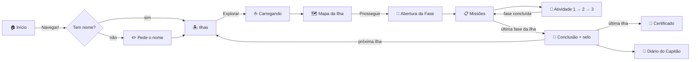

# NavegaKids — Jogo de Segurança na Internet

<div align="center">


</div>

<div align="center">

[](https://git.io/typing-svg)

</div>

<br>

<div align="center">


</div>

<br>

---

## 👥 Nossa Equipe

<div align="center">

<table>
  <tr>
    <td align="center" width="20%">
      <a href="https://github.com/and0994">
        <br>
        <sub><b>Andressa de Oliveira Costa</b></sub>
      </a>
    </td>
    <td align="center" width="20%">
      <br>
        <sub><b>Isabella Rodrigues Rustice</b></sub>
    </td>
    <td align="center" width="20%">
      <br>
        <sub><b>Lucas Pinheiro Marques</b></sub>
    </td>
    <td align="center" width="20%">
      <a href="https://github.com/b3ery">
        <br>
        <sub><b>Mylena Soares Rocha</b></sub>
      </a>
    </td>
    <td align="center" width="20%">
      <br>
        <sub><b>Thais Luana Flores Quelca</b></sub>
    </td>
  </tr>
</table>

</div>

<br>

---

## 🌊 Sobre o Projeto

> **NavegaKids** é um jogo educativo para crianças sobre **segurança na internet e prevenção ao grooming digital**. Ao lado da **Capitã Bússola**, o pequeno navegador atravessa **3 ilhas, 15 fases e 45 atividades** para aprender a reconhecer perfis suspeitos, proteger seus dados, sair de conversas que incomodam, bloquear, denunciar e — principalmente — **pedir ajuda a um adulto de confiança**. Tudo em HTML + CSS + JavaScript puro, sem dependências. 🏴‍☠️

<br>

<div align="center">

```
╔══════════════════════════════════════════════════════════════════════╗
║  🏠 Início  →  🏝️ Ilhas  →  🗺️ Mapa da Ilha  →  ⛵ Abertura da Fase  ║
║                                                        ↓             ║
║  📜 Certificado  ←  📖 Diário  ←  🏅 Conclusão  ←  🎯 3 Atividades    ║
╚══════════════════════════════════════════════════════════════════════╝
```

</div>

<br>

---

## 🏝️ As Três Ilhas

### 🔍 Ilha 1 — Ilha dos Mistérios · selo *Observador Atento*

<div align="center">

| Fase | Título | O que a criança aprende |
|:---:|:---|:---|
| 1 | **Perfil Misterioso..?** | Não aceitar pedido de amizade de quem não conhece; ignorar ou bloquear quem insiste |
| 2 | **Amigo ou Desconhecido?** | Jogar junto é diferente de conhecer de verdade |
| 3 | **A Mensagem Estranha** | Elogio exagerado, pergunta pessoal e pedido de segredo são sinais de alerta |
| 4 | **O Segredo Digital** | Segredo que pede silêncio dos adultos merece ser contado; dados pessoais são só seus |
| 5 ⭐ | **Missão: Cadê o Perigo?** | Revisão da ilha — **estrelas em dobro** |

</div>

### 🛡️ Ilha 2 — Ilha das Escolhas · selo *Guardião das Escolhas Seguras*

<div align="center">

| Fase | Título | O que a criança aprende |
|:---:|:---|:---|
| 6 | **Vamos Conversar em Outro Lugar?** | Convite para um espaço privado é sinal de alerta |
| 7 | **Escolha a Mensagem Certa** | Responder de forma educada e firme |
| 8 | **Hora de Sair** | Sair de uma conversa que incomoda é se cuidar |
| 9 | **Ative o Escudo** | Usar o bloqueio dos aplicativos (com vídeo explicativo) |
| 10 ⭐ | **Missão: Escolha Segura** | Revisão da ilha com quiz cronometrado — **estrelas em dobro** |

</div>

### 🤝 Ilha 3 — Ilha dos Guardiões · selo *Guardião dos Mares*

<div align="center">

| Fase | Título | O que a criança aprende |
|:---:|:---|:---|
| 11 | **Meu Time de Confiança** | Quem são os adultos de confiança; pedir ajuda é coragem |
| 12 | **Quebrando o Silêncio** | Contar sempre ajuda; a culpa nunca é da criança |
| 13 | **Sinal de Socorro** | Onde fica o botão Denunciar e os canais oficiais, como o Disque 100 (com vídeo) |
| 14 | **Guardião de um Amigo** | Como apoiar um amigo e ir junto falar com um adulto |
| 15 ⭐ | **Missão: Guardião dos Mares** | Revisão das três ilhas — **estrelas em dobro** e certificado final |

</div>

<br>

---

## 🎮 Tipos de Atividade

<div align="center">

| Tipo | Nome no código | Como a criança joga |
|:---:|:---:|:---|
| 🔎 **Descoberta** | `discover` | Lê uma cena (chat, lobby, guardiões) com uma dica |
| 🎬 **Explicativa** | `explain` | Assiste a um vídeo curto (fases 9 e 13) |
| 🗳️ **Escolha** | `choice` | Decide entre opções; tem versão "tutorial" e "duelo de cartas" |
| 🕵️ **Caça às pistas** | `hunt` | Toca nos sinais escondidos num perfil, chat, aplicativo ou cena |
| 🗂️ **Classificar** | `classify` | Arrasta (ou toca) cada item para o grupo certo |
| 🚪 **Portas** | `doors` | Abre portas e descobre se o lugar é seguro ou arriscado |
| ⏱️ **Quiz** | `quiz` | Perguntas rápidas, com cronômetro ou no formato Verdade ou Mito |
| 🔢 **Sequência** | `sequence` | Monta os passos na ordem certa |
| ✍️ **Montar frase** | `compose` | Junta blocos para formar uma resposta segura |
| 🔗 **Associar** | `match` | Liga cada situação à ação correta |
| 🛡️ **Bloquear** | `block` | Ativa o escudo contra o contato insistente |
| 🧰 **O Peso do Segredo** | `bau` | Animação do baú que fica leve quando o segredo é contado |

</div>

<br>

---

## ⭐ Pontos e Estrelas

<div align="center">

| Regra | Valor |
|:---|:---:|
| Pontos por atividade | **10** (cada erro tira 3, mínimo 4) |
| Estrelas por fase | **0 erros = 3★** · **1 a 2 erros = 2★** · **3 ou mais = 1★** |
| Fases 5, 10 e 15 (estrela no card) | **estrelas e pontos x2** |
| Refazer uma atividade | vale a **melhor** tentativa |
| Completar as 5 fases de uma ilha | **selo** da ilha |
| Máximo da jornada | **54 estrelas** |

</div>

Erros que **não** contam: abrir as portas, os "Avançar" das telas de leitura e tocar no botão errado nas atividades de achar o botão no aplicativo (a criança está explorando a tela).

> O progresso **não é salvo**: por decisão do grupo, ele volta ao zero ao recarregar a página.

<br>

### 🗺️ Fluxo das Telas



<br>

---

## ⚙️ Funcionalidades

<div align="center">

| Funcionalidade | Status | Descrição |
|:---:|:---:|:---|
| 🏝️ **3 ilhas, 15 fases, 45 atividades** | ✅ | Conteúdo fiel ao roteiro pedagógico |
| 🎮 **12 tipos de atividade** | ✅ | Escolha, caça às pistas, classificar, quiz, sequência e mais |
| ⭐ **Estrelas em dobro** | ✅ | Selo "x2" nas fases 5, 10 e 15 e a conta "2 × 2 = 4 estrelas!" |
| 🏅 **Selos por ilha** | ✅ | Observador Atento, Guardião das Escolhas Seguras e Guardião dos Mares |
| 📖 **Diário do Capitão** | ✅ | Nome, tempo jogado, level, selos e ilhas |
| 📜 **Certificado** | ✅ | Frente e verso que viram com um clique, pronto para imprimir |
| 🎬 **Vídeos explicativos** | ✅ | Fases 9 (escudo) e 13 (denúncia) |
| 🎵 **Música de fundo** | ✅ | Jiga de pirata gerada pelo navegador, com botão liga/desliga |
| 🔔 **Sons de acerto, erro e vitória** | ✅ | Feedback sonoro em todas as atividades |
| ✨ **Telas animadas** | ✅ | Entradas em cascata, personagens flutuando, confetes na conclusão |
| 👋 **Home personalizada** | ✅ | Balão do pirata com o nome, as estrelas e a próxima ilha |
| ♿ **Acessibilidade** | ✅ | Respeita "reduzir movimento", textos alternativos e navegação por teclado |
| 🧪 **Modo de teste** | ✅ | `?dev=1` libera todas as fases |

</div>

<br>

---

## 🚀 Como Executar

**💻 Local:**
```bash
git clone https://github.com/b3ery/NavegaKids.git
cd NavegaKids

# Abra o arquivo no navegador
open index.html
# ou dê dois cliques no index.html
```

- Com `?dev=1` no fim do endereço, todas as fases ficam liberadas (modo de teste).
- Se uma mudança não aparecer, aperte **Ctrl+F5** para o navegador recarregar os arquivos.
- A música começa no primeiro clique (os navegadores não deixam tocar som antes disso).

> Sem dependências externas. HTML5 + CSS3 + JavaScript puro. ✨

<br>

---

## 📁 Estrutura do Projeto

```
NavegaKids/
├── index.html          # Página única do jogo (a ordem dos scripts importa)
├── css/
│   └── style.css       # Todos os estilos e animações
├── js/
│   ├── config.js       # Liga cada imagem da pasta img/ a um nome
│   ├── data.js         # Todo o conteúdo: ilhas, fases e atividades
│   ├── pontuacao.js    # Regras de pontos e estrelas (objeto REGRAS)
│   ├── progresso.js    # Progresso da sessão: atividades, erros, pontos, estrelas, selos, nome
│   ├── core.js         # Utilitários, imagens, popups e cabeçalho
│   ├── activities.js   # Tela de atividade + discover, explain, choice, doors, block
│   ├── activities2.js  # classify, hunt, sequence, compose, quiz, match, bau
│   ├── musica.js       # Música de fundo e efeitos sonoros (Web Audio)
│   └── router.js       # As telas: Início, Ilhas, Mapa, Abertura, Missões, Conclusão, Diário, Certificado
├── img/                # Artes e ícones do jogo
├── videos/             # Vídeos das fases 9 e 13
└── README.md           # Este arquivo
```

Todo o código fica dentro de **uma única variável global**, `NavegaKids`, para não conflitar com as landing pages dos outros times.

<br>

---

## 🛠️ Para Quem Vai Mexer no Código

### Conteúdo
- Textos, fases e atividades ficam em `js/data.js`.
- Para contar um erro numa atividade nova, chame `progresso.registrarErro()` quando a criança errar.
- Para tocar os sons, use `NavegaKids.som.acerto()`, `.erro()` ou `.vitoria()`.
- Uma fase com `dobro: true` vale estrelas e pontos em dobro e ganha o selo "x2" automaticamente.

### Artes
Para trocar uma arte, coloque o PNG em `img/` e ajuste o nome em `js/config.js`. Use nomes sem espaço e sem acento (ex.: `ilha-praia.png`).

<div align="center">

| Arte | Onde aparece | Onde se configura |
|:---|:---|:---|
| `estrela.png` | cabeçalho, mapa da ilha, popups e Diário | `js/config.js` (`estrela`) |
| `medalha.png` | "Principais Conquistas" no Diário e "FASE ATUAL" em Missões | `js/config.js` (`medalha`) |
| `navio-pirata.png` | card "FASE ATUAL" do mapa de cada ilha | `js/config.js` (`navioPirata`) |
| `ilha-praia.png`, `ilha-arvores.png`, `ilha-montanhas.png` (+ `-bloqueada`) | seção "Ilhas" do Diário | `js/data.js`, campos `icone` e `iconeBloqueado` |
| `luneta.png`, `escudo.png`, `navio-mayflower.png` | selo de cada ilha (Diário e popup) | `js/data.js`, campo `seloImg` |

</div>

### Vídeos
Coloque o `.mp4` em `videos/` e adicione `video: "videos/nome.mp4"` na atividade do tipo `explain` em `js/data.js`.

<br>

---

<div align="center">

Feito com 🧭 muita <code>navegação</code> e ⭐ <code>estrelas</code> — para crianças navegarem com segurança

<br>


</div>
